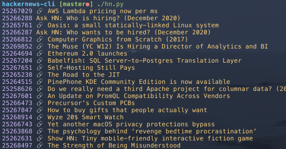

# CLI client for news.ycombinator.com

This little app provied access to the top stories from hackernews in the command line

[[image]]

## Usage

`hn.py -h` prints a some hints on how to use the app

### Get latest top stories

A simple invocation of `hn.py` fetches the latest 20 top stories. To tweak how many stories are fetched change the `n` parameter in the config.

The stories are printed as a list, showing the id, the title, and a little marker telling if the story is an external link.



### Open a story in the browser

`hn.py` outputs the story-id of every fetched story. To open a story in the browser use the `open` command with a story id

```shell
hn.py open [storyid]
```

The history file will track how many times a story has been opened in the browser

### Print a list of the history

`hn.py lh` shows the last n history entries

### Mark stories for later reading

Often enough we find articles that catch our attention but which we can not read yet. To store interesting stories for later reading use the `rl` command. Just like the `open` command it takes a story id and will store an entry into a separate file.

```shell
hn rl 123456
```

To view the complete list of stored stories invoke `rl` wihtout parameters

To prevent an endlessly growing list of read-later-items, hn will delete the file holding the items after a configurable amount of days. The idea behind this feature: Not coming back to the list means the items in there have not been interesting enough.

You can tweak the TTL to your needs with the `rlTTL` field inside `hnconfig.py`. To disable the feature set a TTL of `0`

## Inner life

The script fetches top stories in two steps from the api:

1. The latest 500 top story ids are fetched
1. Out the 500 top notch stories, the first x IDs are picked and used to fetch the actual story (x can be configured)

Stories that are actually downloaded are cached in a history file


## History

Fetched stories are written into a history file to prevent unnecessary repeated invocations of the hackernews api. So, every story is fetched only once from the api. Subsequent invocations of the script will load old stories from the history.

StoryIDs that have been loaded from the history are printed in green when executing the script. Stories loaded from the api, are printed in magenta.
